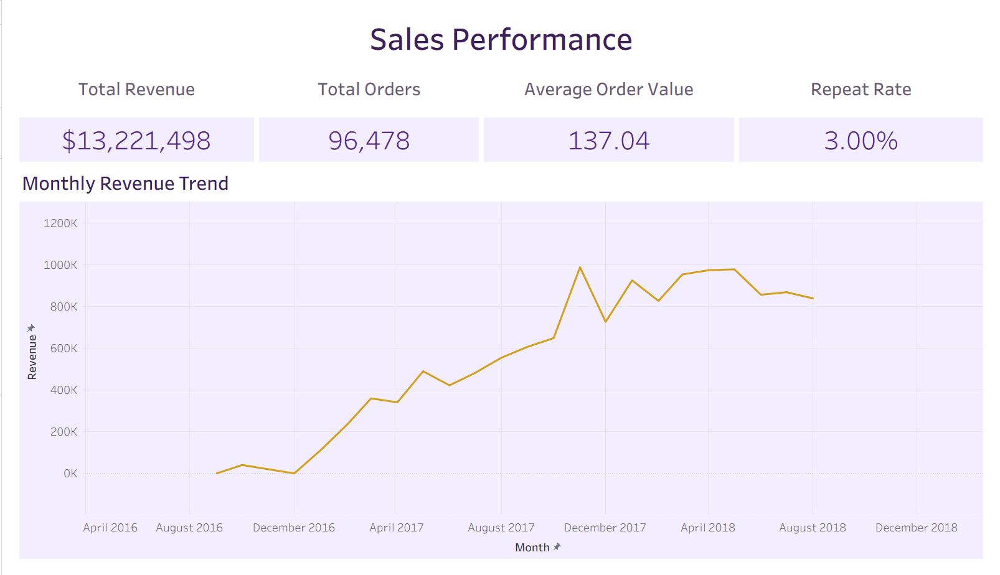

# Olist E-Commerce Analytics: Sales, Customer & Delivery Insights

An end-to-end analytics project digging into customer behavior, sales performance, product trends, regional patterns, and delivery efficiency, built on the [Olist Brazilian E-Commerce Public Dataset](https://www.kaggle.com/datasets/olistbr/brazilian-ecommerce).

**[Check out the interactive dashboard on Tableau Public](https://public.tableau.com/views/OlistE-CommerceSalesAnalysis_17876572101710/salesperformance?:language=en-US&publish=yes&:sid=&:redirect=auth&:display_count=n&:origin=viz_share_link)**




## Why I built this

I wanted a project that went beyond a single notebook, cleaning messy real-world data, exploring it in Python, rebuilding the key metrics in SQL as a sanity check, and then turning all of it into a dashboard someone could actually click through. The goal was to answer real business questions where's the revenue coming from, which categories and regions are pulling their weight, how reliable is delivery, and are customers coming back.

## About the data

Olist is a Brazilian e-commerce platform, and this dataset covers orders placed between September 2016 and August 2018, spread across 9 related tables, orders, order items, customers, products, sellers, payments, reviews, and geolocation. Both the raw and cleaned CSVs are included in this repo under `data/`, since the file sizes were manageable.

## How the repo is organized

```
├── data/
│   ├── raw/              # Original, untouched Olist CSVs
│   └── processed/        # Cleaned CSVs, output of the cleaning notebook
├── notebooks/
│   ├── 1_data_exploration.ipynb   # First pass through all 9 tables
│   ├── 2_data_cleaning.ipynb      # Cleaning steps + export to data/processed/
│   ├── 3_eda.ipynb                # Exploratory analysis and findings
│   └── 4_sql_setup.ipynb          # Loads cleaned data into a SQLite database
├── sql/
│   ├── 01_total_revenue_and_aov.sql
│   ├── 02_top_categories_by_revenue.sql
│   ├── 03_regional_revenue_by_state.sql
│   ├── 04_delivery_performance.sql
│   └── 05_repeat_customer_rate.sql
├── reports/
│   ├── eda_report                              # Full write-up of the EDA
│   └── executive_summary_and_recommendations   # Business recommendations
└── README.md
```

## How I got from raw CSVs to a dashboard

**1. Exploring the data.** Before touching anything, I went table by table checking shape, missing values, duplicates, and data types and wrote down what I found for each of the 9 tables.

**2. Cleaning it up.** Dates got converted to proper datetime types, and missing values were handled based on what actually caused them rather than a blanket rule for example, an order that was never delivered legitimately has no delivery date, so that's not a data error to "fix." The geolocation table was the messiest part: it went from roughly 1,000,000 rows down to 19,015 once I deduplicated it to unique zip-code-level records. Everything cleaned gets exported to `data/processed/`.

**3. Exploring further.** With clean data in hand, I dug into monthly sales trends, category performance, regional distribution, delivery timing, repeat purchase behavior, and how review scores relate to delivery delays, all in pandas and Matplotlib.

**4. Double-checking in SQL.** I rebuilt the core business metrics as SQL queries against a SQLite database, specifically to verify the pandas numbers independently rather than trust a single code path.

**5. Building the dashboard.** The result is a 5-tab Tableau dashboard connected directly to the cleaned CSVs:

- **Overview** — KPI tiles (revenue, orders, AOV) plus the monthly revenue trend
- **Categories** — top categories by revenue and a revenue-vs-volume comparison
- **Regional** — a choropleth map of revenue by state
- **Operations** — delivery delay distribution and on-time vs. late split
- **Customers & Reviews** — repeat vs. one-time customers, and how review scores track with delivery delay

**6. Writing it up.** Findings live in a standalone EDA report, and the business-facing takeaways and recommendations are in a separate executive summary, so someone can read either without needing the other.

## What I found

| Metric | Value |
|---|---|
| Total Delivered Orders | 96,478 |
| Total Revenue | R$13,221,498.11 |
| Average Order Value | R$137.04 |
| Repeat Customer Rate | 3.00% |
| Average Delivery Time | ~12 days |
| Late Delivery Rate | 6.77% |


A few things stood out along the way: a clear Black Friday revenue spike on Nov 24, 2017; Sao Paulo pulling in roughly 2.9x the revenue of the next-highest state; the `computers` category punching well above its weight on average order value despite low volume; and a real, measurable relationship between delivery delays and how customers rate their orders (correlation: -0.327).

The full breakdown is in [`reports/eda_report`](reports/eda_report), and what it means for the business is in [`reports/executive_summary_and_recommendations`](reports/executive_summary_and_recommendations).

## Running it yourself

1. Clone the repo:
   ```
   git clone https://github.com/imanfarooq10/olist-ecommerce-sales-analysis.git
   ```
2. Install the dependencies:
   ```
   pip install pandas numpy matplotlib jupyter ipykernel
   ```
3. Work through the notebooks in order: `1_data_exploration.ipynb` → `2_data_cleaning.ipynb` → `3_eda.ipynb` → `4_sql_setup.ipynb`
4. Open the Tableau workbook locally, or just view the published dashboard using the link at the top of this README.

## Built with

Python (Pandas, NumPy, Matplotlib) · SQL (SQLite) · Tableau Public · Jupyter Notebook · Git & GitHub


## About me

**Iman Farooq** — [GitHub](https://github.com/imanfarooq10)